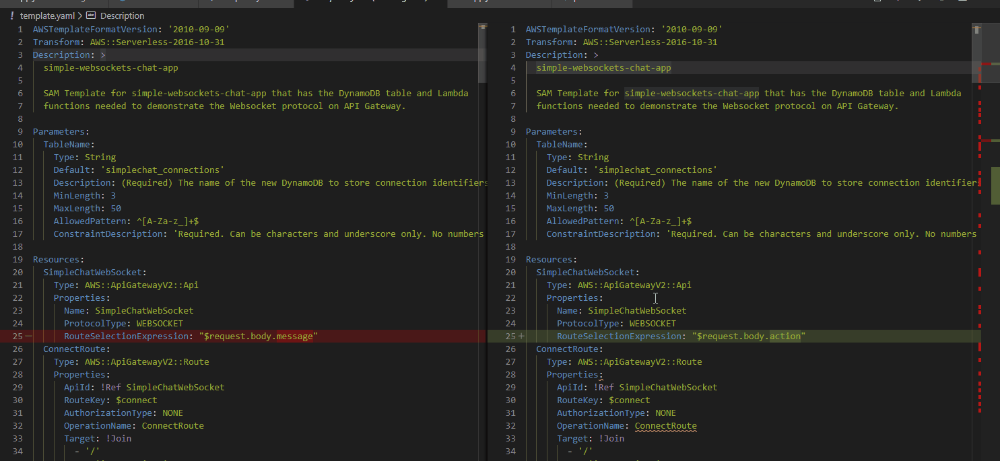
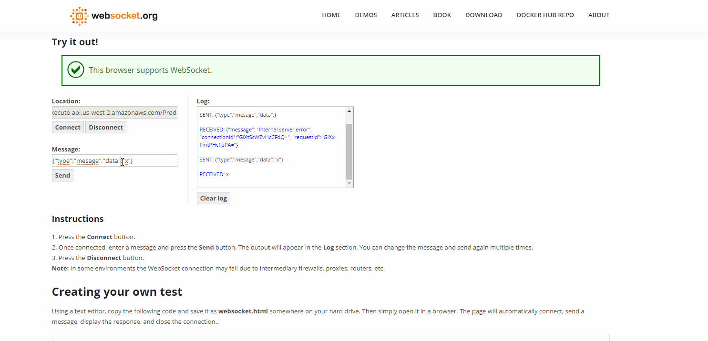

## simple-websockets-chat-app

This fix  allows use the lambda websocket with WEBSOCKET

The main changes are in the apigateway adding the send response as "$default" action with the same function in SendMesage function







# simple-websockets-chat-app

This is the code and template for the simple-websocket-chat-app.  There are three functions contained within the directories and a SAM template that wires them up to a DynamoDB table and provides the minimal set of permissions needed to run the app:

```
.
├── README.md                   <-- This instructions file
├── onconnect                   <-- Source code onconnect
├── ondisconnect                <-- Source code ondisconnect
├── sendmessage                 <-- Source code sendmessage
└── template.yaml               <-- SAM template for Lambda Functions and DDB
```


# Deploying to your account

You have two choices for how you can deploy this code.

## Serverless Application Repository

The first and fastest way is to use AWS's Serverless Application Respository to directly deploy the components of this app into your account without needing to use any additional tools. You'll be able to review everything before it deploys to make sure you understand what will happen.  Click through to see the [application details](https://serverlessrepo.aws.amazon.com/applications/arn:aws:serverlessrepo:us-east-1:729047367331:applications~simple-websockets-chat-app).

## AWS CLI commands

If you prefer, you can install the [AWS SAM CLI](https://docs.aws.amazon.com/serverless-application-model/latest/developerguide/serverless-sam-cli-install.html) and use it to package, deploy, and describe your application.  These are the commands you'll need to use:

```
sam package \
    --template-file template.yaml \
    --output-template-file packaged.yaml \
    --s3-bucket REPLACE_THIS_WITH_YOUR_S3_BUCKET_NAME

sam deploy \
    --template-file packaged.yaml \
    --stack-name simple-websocket-chat-app \
    --capabilities CAPABILITY_IAM \
    --parameter-overrides MyParameterSample=MySampleValue

aws cloudformation describe-stacks \
    --stack-name simple-websocket-chat-app --query 'Stacks[].Outputs'
```

## Testing the chat API

To test the WebSocket API, you can use [wscat](https://github.com/websockets/wscat), an open-source command line tool.

1. [Install NPM](https://www.npmjs.com/get-npm).
2. Install wscat:
``` bash
$ npm install -g wscat
```
3. On the console, connect to your published API endpoint by executing the following command:
``` bash
$ wscat -c wss://{YOUR-API-ID}.execute-api.{YOUR-REGION}.amazonaws.com/{STAGE}
```
4. To test the sendMessage function, send a JSON message like the following example. The Lambda function sends it back using the callback URL: 
``` bash
$ wscat -c wss://{YOUR-API-ID}.execute-api.{YOUR-REGION}.amazonaws.com/prod
connected (press CTRL+C to quit)
> {"message":"sendmessage", "data":"hello world"}
< hello world
```

## License Summary

This sample code is made available under a modified MIT license. See the LICENSE file.
